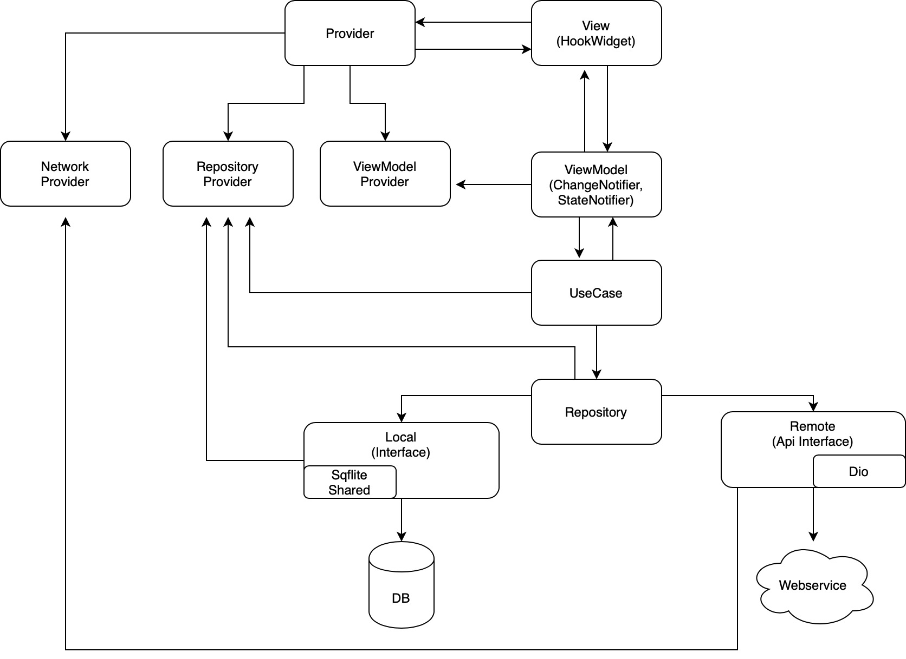

# river_movies

A new Flutter application.

## App architecture
- Base on [MVVM](https://en.wikipedia.org/wiki/Model%E2%80%93view%E2%80%93viewmodel)

## Data Flow

## Run with Flavor (dev | stag | prod)

`flutter run --flavor dev --dart-define=FLAVOR=dev`

## Environment

**iOS**
- iOS 13+

**Android**
- Android 5.1+
    - minSdkVersion 22
- targetSdkVersion 30

## Code Style
- [Effective Dart](https://dart.dev/guides/language/effective-dart)

## Assets, Fonts

**If added some assets or fonts**

- Use [FlutterGen](https://github.com/FlutterGen/flutter_gen/)

## Models

**If added some models for api results**

- Use [Freezed](https://pub.dev/packages/freezed)

## Localizations

**If added some localizations (i.g. edited [*.arb](https://github.com/wasabeef/flutter-architecture-blueprints/tree/main/lib/l10n))**

- Use [Official Flutter localization package](https://docs.google.com/document/d/10e0saTfAv32OZLRmONy866vnaw0I2jwL8zukykpgWBc)