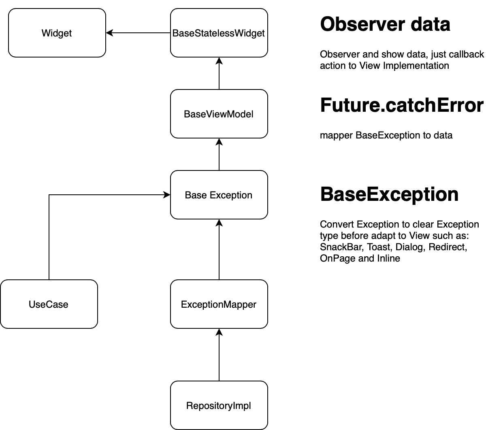

# flutter_clean_architecture

This is a simple for Clean Architecture using the Provider Pattern

## App architecture
- Base on [MVVM](https://en.wikipedia.org/wiki/Model%E2%80%93view%E2%80%93viewmodel) + [CleanArchitecture](https://blog.cleancoder.com/uncle-bob/2012/08/13/the-clean-architecture.html)

## Data Flow


## Exception Flow


## Run with Flavor (dev | stag | prod)

`flutter run --flavor dev --dart-define=FLAVOR=dev`
If using the another library not build with null-safety. Please run with argument `flutter run --no-sound-null-safety`

## Environment
**Framework**
- Dart: '>=2.12.0 <3.0.0'
- Flutter: '>=2.0.0'

**iOS**
- iOS 13+

**Android**
- Android 5.1+
    - minSdkVersion 22
- targetSdkVersion 30

## Code Style
- [Effective Dart](https://dart.dev/guides/language/effective-dart)

## Assets, Fonts

**If added some assets or fonts**

- Use [FlutterGen](https://github.com/FlutterGen/flutter_gen/)

## Models

**If added some models for api results**

- Use [Freezed](https://pub.dev/packages/freezed)

## Auto generate resource
`flutter packages pub run build_runner build --delete-conflicting-outputs`

## Auto generate mock class using on Unit Test 
Example: After created the test class, and run command below, the mock class `MockMovieRepository` will auto generate 
```Dart
@GenerateMocks([MovieRepository])
void main() {
  late MovieRepository repository;
}
```
`flutter pub run  build_runner build --delete-conflicting-outputs`

## Auto generate asset image
`fluttergen -c pubspec.yaml`

## Getting Started

This project is a starting point for a Flutter application.

A few resources to get you started if this is your first Flutter project:

- [Lab: Write your first Flutter app](https://flutter.dev/docs/get-started/codelab)
- [Cookbook: Useful Flutter samples](https://flutter.dev/docs/cookbook)

For help getting started with Flutter, view our
[online documentation](https://flutter.dev/docs), which offers tutorials,
samples, guidance on mobile development, and a full API reference.
